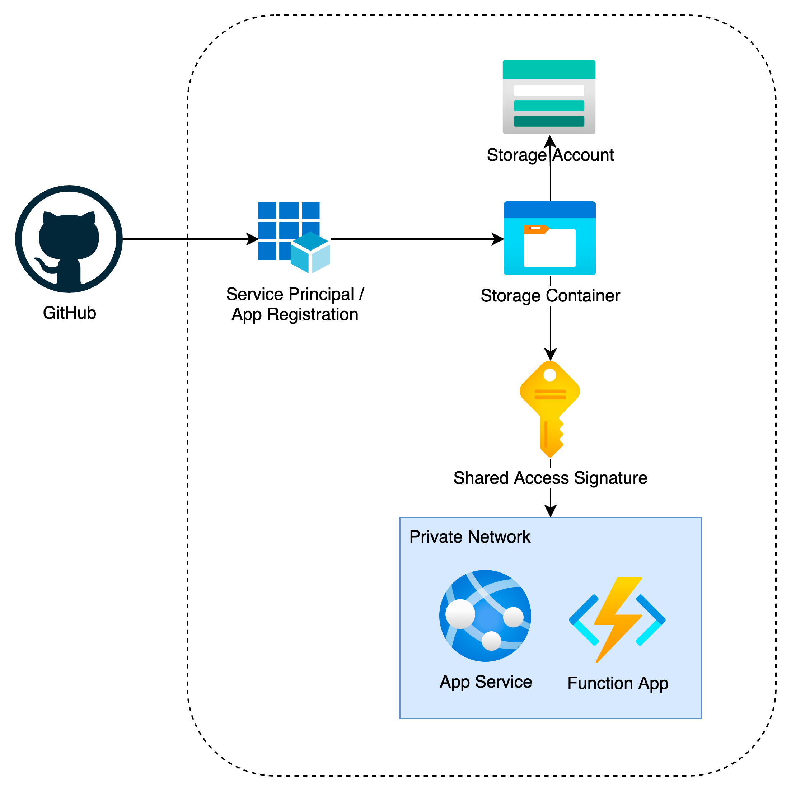

# Node Hello World

Simple node.js app that servers "hello world"

Great for testing simple deployments to the cloud

## Run It

`npm start`

## GitHub to Private App Service/Function



In order for GitHub to be able to deploy to a private App Service/Function App, the following Azure resources are required:

Service Principal

Storage Account

Storage Container

Shared Access Signature

Deployment Overview:

GitHub is responsible for testing and building the application.

When App Service/Function App is public, GitHub is able to directly deploy those services. However when these services become private the SCM endpoint is no longer reachable and the app must be deployed via the ARM endpoint.

When App Service/Function App is private, instead of directly deploying the application files into the services, GitHub will first upload it into a storage container

The App Service/Function App would then take the application files from the storage container and deploy it. When it does this, the traffic is routed through the ARM endpoint instead.

Example Deployment:

GitHub - jeromelieow-swift/node-hello: Hello World for Node.js

The example follows the guide here: Deploying to Network-secured sites, Part 2
The az rest command was fixed thanks to this stackoverflow thread here: Deploy to an Azure Web App with a private endpoint

Instructions:

Create an app registration/service principal.

Name = {PROJECT_NAME}-{prod/staging/dev}-github-cicd-private

Register

Go into the subscription where the Private App Service/Function App exists and update the following resource groups with the Storage Account Contributor role and GitHub CICD Websites Write Role

Resource Group = storage-rg

Role = Storage Account Contributor

Members = {PROJECT_NAME}-{prod/staging/dev}-github-cicd-private-app-service

Review + assign

Resource Group = app-rg

Role = GitHub CICD Websites Write

Members = {PROJECT_NAME}-{prod/staging/dev}-github-cicd-private-app-service

Review + assign

Return back to the app registration/service principal that was created:

Go to Certificates and Secrets and create a new client secret

Name = github-cicd-private-app-service-secret

Populate the following code snippet with the correct values

```
{
   "clientId": "<APPLICATION_(CLIENT)_ID>",
   "clientSecret": "<Value of github-cicd-private-app-service>",
   "subscriptionId": "<SUBSCRIPTION_ID>",
   "tenantId": "<DIRECTORY_(TENANT)_ID>",
   "activeDirectoryEndpointUrl": "https://login.microsoftonline.com",
   "resourceManagerEndpointUrl": "https://management.azure.com/",
   "activeDirectoryGraphResourceId": "https://graph.windows.net/",
   "sqlManagementEndpointUrl": "https://management.core.windows.net:8443/",
   "galleryEndpointUrl": "https://gallery.azure.com/",
   "managementEndpointUrl": "https://management.core.windows.net/"
}
```

Create a GitHub Action Secret by going into the repository > Settings > Secrets > Actions > New repository secret

Secret 1

Name = AZURE_CREDENTIALS

Secret = Code snippet above

Secret 2

Name = SUBSCRIPTION_ID

Secret = Subscription ID of where the web app is deployed

Connect the app service deployment center to your GitHub repository in order to generate a workflow file.

Disable the auto generated workflow file

Create a new workflow file with the name of the old workflow file and add the following “deploy-to-private-app-service” to the start of the file name.

For example, if the auto generated workflow file is called “main-fx.yml“, the new workflow file should be named “deploy-to-private-app-service-main-fx.yml“

Update the workflow file to create a storage account, container, and deploy via az rest command by following the example here: https://github.com/jeromelieow-swift/node-hello

In the workflow file, add the following env:

WEB_APP: {NAME OF APP SERVICE/FUNCTION APP}
APP_GROUP: {Resource group which contains the app service/function app}
STORAGE_GROUP: {Resource group which will hold the storage account and container}
STORAGE_ACCOUNT: {PROJECT_NAME}{prod/staging/dev}cicd001st # Does not have to exist, this will be created for you. Maximum 24 characters, small letters and alphabets only.
STORAGE_CONTAINER: {PROJECT_NAME}{prod/staging/dev}cicd001c
EXPIRY_TIME: 10 minutes
LOCATION: southeastasia
das
